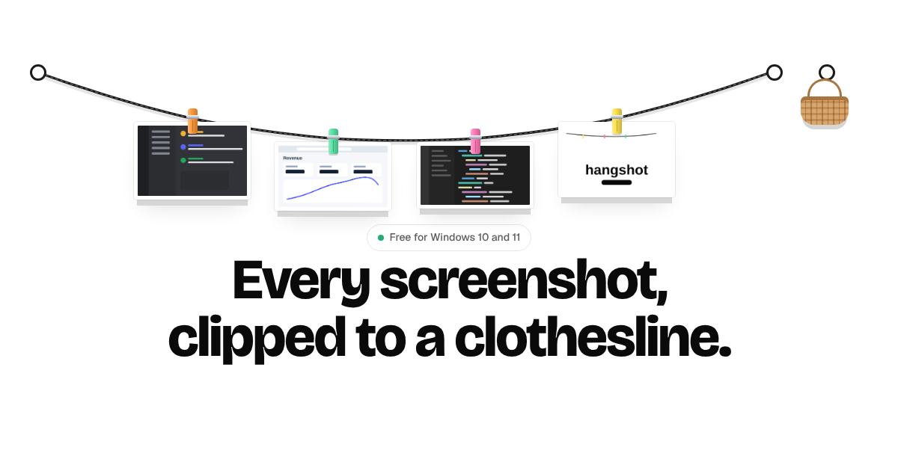

# Hangshot

**Every screenshot, clipped to a clothesline.**

Hangshot is a free Windows app that hangs every screenshot you take on a rope across the top of your screen. Drag one into any app, pin the keepers, and let the rest dry off into the basket.

## Download

**[Download Hangshot for Windows](https://github.com/deeprajdev/hangshot/releases/latest/download/Hangshot-Setup.exe)** · Windows 10 and 11, 64-bit

First launch: if Windows shows "Windows protected your PC", click **More info**, then **Run anyway**. Hangshot updates itself after that.

Website: [hangshot.vercel.app](https://hangshot.vercel.app/)

---

Made by [@deeprajO1](https://x.com/deeprajO1). Inspired by [@alejandr0bujan](https://x.com/alejandr0bujan)'s clothesline for Mac.
